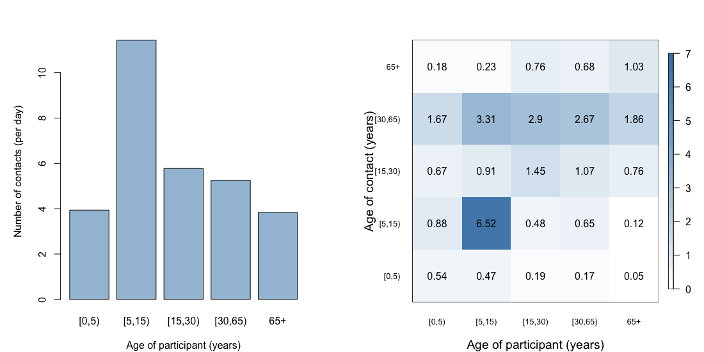
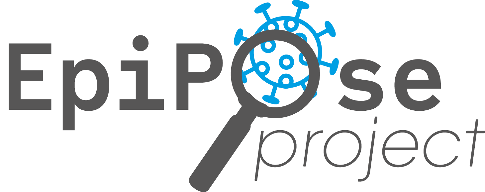

# CoMix study

## Description of the study
[CoMix](https://www.uhasselt.be/en/aparte-sites-partner-en/epipose/the-comix-study) is a social contact survey that followed households across Europe over the course of the COVID-19 pandemic. In Switzerland, we conducted a total of 24 survey waves from 22 January 2021 to 19 May 2022 (Figure 1) ([Reichmuth et al., 2024](https://doi.org/10.1016/j.epidem.2024.100771)). The market research company Ipsos MORI recruited a nationally representative sample of study participants using quota sampling based on age, gender, region, and work status through a combination of social media, web advertising, and email campaigns. The survey included adults aged 18 or above and parents (at least 18 years old) who completed the surveys on behalf of their children (<18 years old). For parents, quotas were set on region only.

Participants reported their social contacts made on the day prior to survey participation. A contact was defined as anyone who met the participant in person with whom at least a few words were exchanged or physical contact was made. Furthermore, the survey asks people about their awareness, attitudes and behaviors in response to COVID-19, and their vaccination status. From December 2021 until the end of the study, we included additional questions regarding attitudes towards vaccination that were developed together with the Federal Office of Public Health (FOPH). The design of the survey is largely based on the POLYMOD study ([Mossong et al., 2008](https://doi.org/10.1371/journal.pmed.0050074)). Further details about the study design and methodology have been published elsewhere ([Verelst et al., 2021](https://doi.org/10.1186/s12916-021-02133-y); [Wong et al., 2023](https://doi.org/10.1186/s12879-023-08214-y)). The CoMix study protocols and questionnaires were approved by the local ethics committee of the Canton of Bern (project number 2020–02926), all methods were carried out in accordance with regulations, and informed consent of participants was obtained.


**Figure 1. COVID-19 epidemic and social contact survey in Switzerland.** A: Reported number of hospitalized COVID-19 cases reported by the FOPH colored by the proportion of variants sequenced. Gray bars and digits represent each CoMix survey wave. B: Mean number and 95% confidence interval of social contacts by age group and wave. Figure from [Reichmuth et al., 2024](https://doi.org/10.1016/j.epidem.2024.100771).

## Data
The social contact data from the first 16 survey waves are available on [Zenodo](https://doi.org/10.5281/zenodo.6542656). Social contact data for all 24 survey waves will be made available later.

[](https://doi.org/10.5281/zenodo.6542656)
[](https://creativecommons.org/licenses/by/4.0/)

## Social contact matrices
To analyze the data and create social contact matrices, we recommend to install the `R` package [`socialmixr`](https://github.com/epiforecasts/socialmixr):
```r
install.packages("socialmixr")
```
The data from the first 16 survey waves of the Swiss CoMix study can be downloaded using the function `get_survey()`:
```r
library(socialmixr)
comix <- get_survey("https://doi.org/10.5281/zenodo.6542656")
```
The `contact_matrix()` function extracts a contact matrix from survey data and contact matrices can be plotted using the function `matrix_plot()`:
```r
library(tidyverse)
comix$participants <- comix$participants %>% filter(panel %in% c("A", "C"))
m <- contact_matrix(comix,
                    age.limits = c(0, 5, 15, 30, 65),
                    symmetric = TRUE,
                    weigh.dayofweek = TRUE)         
par(mfrow = c(1, 2))
colfunc <- colorRampPalette(c("steelblue", "white"))
barplot(rowSums(m$matrix),
        names.arg = m$participants$age.group,
        col = colfunc(3)[2],
        xlab = "Age of participant (years)",
        ylab = "Number of contacts (per day)")
matrix_plot(m$matrix,
            color.palette = colfunc,
            xlab = "Age of participant (years)",
            ylab = "Age of contact (years)",
            main = NA)
```


**Figure 2. Average number of contacts by age group and social contact matrix.** Data include the first nine survey waves (panels A and C) from 22 January 2021 to 17 May 2021.

## Reports
1. [CoMix social contact survey: Report for Switzerland rounds 1 to 16](reports/Report_CoMix_Switzerland_20210928.pdf) (28 Sep 2021)
2. [Social contacts and attitudes towards vaccination during the COVID-19 pandemic: Insights from the CoMix study](reports/Report_CoMix_Switzerland_20220913.pdf) (13 Sep 2022)

## Publications
The following publications include data from the CoMix survey in Switzerland:

1. [Social contacts in Switzerland during the COVID-19 pandemic: insights from the CoMix study](https://doi.org/10.1016/j.epidem.2024.100771). Reichmuth ML, Heron L, Beutels P, Hens, N, Low N, Althaus CL. **Epidemics**. 2024 May 10.
2. [Social contact patterns following the COVID-19 pandemic: a snapshot of post-pandemic behaviour from the CoMix study](https://doi.org/10.1101/2023.08.29.23294767). Jarvis CI, Coletti P, Backer JA, Munday JD, Faes C, Beutels P, Althaus CL, Low N, Wallinga J, Hens N, Edmunds WJ. **medRxiv**. 2023.08.29.23294767.
3. [Socio-demographic characteristics associated with COVID-19 vaccination uptake in Switzerland: longitudinal analysis of the CoMix study](https://doi.org/10.1186/s12889-023-16405-0). Reichmuth ML, Heron L, Riou J, Moser A, Hauser A, Low N, Althaus CL. **BMC Public Health**. 2023 Aug 10;23(1):1523.
4. [The influence of COVID-19 risk perception and vaccination status on the number of social contacts across Europe: insights from the CoMix study](https://doi.org/10.1186/s12889-023-16252-z). Wambua J, Loedy N, Jarvis CI, Wong KL, Faes C, Grah R, Prasse B, Sandmann F, Niehus R, Johnson H, Edmunds WJ, Beutels P, Hens N, Coletti P. **BMC Public Health**. 2023 Jul 13;23(1):1350.
5. [Social contact patterns during the COVID-19 pandemic in 21 European countries – evidence from a two-year study](https://doi.org/10.1186/s12879-023-08214-y). Wong KL, Gimma A, Coletti P, CoMix Europe Working Group, Faes C, Beutels P, Hens N, Jaeger VK, Karch A, Johnson H, Edmunds WJ, Jarvis CI. **BMC Infect Dis**. 2023 Apr 26;23(1):268.
6. [Pregnancy during COVID-19: social contact patterns and vaccine coverage of pregnant women from CoMix in 19 European countries](https://doi.org/10.1186/s12884-022-05076-1). Wong KLM, Gimma A, Paixao ES; CoMix Europe Working Group, Faes C, Beutels P, Hens N, Jarvis CI, Edmunds WJ. **BMC Pregnancy Childbirth**. 2022 Oct 8;22(1):757.

## Other useful repositories
- [comix_data_clean](https://github.com/jarvisc1/comix_data_clean): For cleaning, processing, and serving CoMix data.
- [comix_epipose](https://github.com/amygimma/comix_epipose): Report templates for the CoMix Survey.

## Team
- [PD Dr. Christian Althaus](https://www.ispm.unibe.ch/about_us/staff/althaus_christian/index_eng.html)
- [Dr. Martina Reichmuth](https://www.ispm.unibe.ch/about_us/staff/reichmuth_martina/index_eng.html)
- [Prof. Dr. Nicola Low](https://www.ispm.unibe.ch/about_us/staff/low_nicola/index_eng.html)
- [Dr. Leonie Heron](https://www.ispm.unibe.ch/about_us/staff/heron_leonie/index_eng.html)

## Contact
If you have any questions regarding the Swiss CoMix survey, please send an email to christian.althaus@unibe.ch.

## Acknowledgement


We acknowledge financial support from the European Union’s [Horizon 2020](https://research-and-innovation.ec.europa.eu/funding/funding-opportunities/funding-programmes-and-open-calls/horizon-2020_en) research and innovation programme - project [EpiPose](https://www.uhasselt.be/en/aparte-sites-partner-en/epipose) (No [101003688](https://doi.org/10.3030/101003688)) and the [Federal Office of Public Health (FOPH)](https://www.bag.admin.ch/bag/en/home.html) (No [014200499](https://www.aramis.admin.ch/Grunddaten/?ProjectID=49920&Sprache=en-US)). We also like to thank the [European Centre for Disease Prevention and Control (ECDC)](http://ecdc.europa.eu/) and the CoMix Europe Working Group for setting up the collaborations across more than 20 European countries, and the partners at [Ipsos MORI](https://www.ipsos.com) for running the survey.
