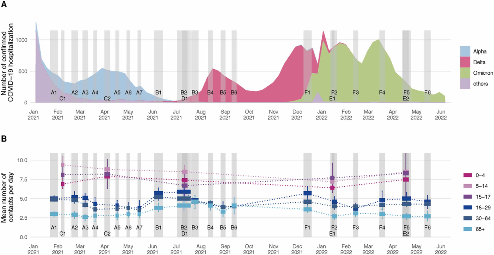

# CoMix study

## Description of the study
CoMix is a social contact survey that followed households across Europe over the course of the COVID-19 pandemic ([Verelst et al., 2021](https://doi.org/10.1186/s12916-021-02133-y)). In Switzerland, we conducted a total of 24 survey waves from 22 January 2021 to 19 May 2022 (Figure). The market research company Ipsos MORI recruited a nationally representative sample of study participants using quota sampling based on age, gender, region, and work status through a combination of social media, web advertising, and email campaigns. The survey included adults aged 18 or above and parents (at least 18 years old) who completed the surveys on behalf of their children (<18 years old). For parents, quotas were set on region only.

Participants reported their social contacts made on the day prior to survey participation. A contact was defined as anyone who met the participant in person with whom at least a few words were exchanged or physical contact was made. Furthermore, the survey asks people about their awareness, attitudes and behaviors in response to COVID-19, and their vaccination status. From December 2021 until the end of the study, we included additional questions regarding attitudes towards vaccination that were developed together with the Federal Office of Public Health (FOPH). The design of the survey is largely based on the POLYMOD study ([Mossong et al., 2008](https://doi.org/10.1371/journal.pmed.0050074)). Further details about the study design and methodology have been published elsewhere ([Verelst et al., 2021](https://doi.org/10.1186/s12916-021-02133-y); [Wong et al., 2022](https://doi.org/10.1101/2022.07.25.22277998)).

**Figure. Crude mean number of contacts by survey wave and age group in Switzerland.** Numbers represent all contacts and contacts were truncated at 50 per day. Data cover the time period from January 2021 to May 2022.

## Data
This report provides a brief description of the social contact data and attitudes towards vaccination as reported in the multiple survey waves. From December 2021 until the end of the study, we provided monthly reports to FOPH that summarize the main results from the latest survey waves. Further analyses of the data are ongoing and will be made available to the public in open-access journals. The social contact data from the first 16 survey waves are available on socialcontactdata.org. Social contact data for all 24 survey waves will be made available on GitHub: github.com/ISPMBern/comix.

## Team
- [Martina Reichmuth, MSc](https://duckduckgo.com/?q=reichmuth+ispm&t=osx&ia=web)
- [Dr. Leonie Heron](https://www.ispm.unibe.ch/about_us/staff/heron_leonie/index_eng.html)
- [Prof. Dr. Nicola Low](https://www.ispm.unibe.ch/about_us/staff/low_nicola/index_eng.html)
- [PD Dr. Christian Althaus](https://www.ispm.unibe.ch/about_us/staff/althaus_christian/index_eng.html)

## Acknowledgement

We acknowledge financial support from FOPH and the European Union’s Horizon 2020 research and innovation programme - project [EpiPose](https://www.uhasselt.be/en/aparte-sites-partner-en/epipose) (No 101003688). We also like to thank the European Centre for Disease Prevention and Control (ECDC) and the CoMix Europe Working Group for setting up the collaborations across more than 20 European countries, and the partners at Ipsos MORI for running the survey.
